# flashpaws

A new Flutter project.

## Getting Started

This project is a starting point for a Flutter application.

A few resources to get you started if this is your first Flutter project:

- [Lab: Write your first Flutter app](https://docs.flutter.dev/get-started/codelab)
- [Cookbook: Useful Flutter samples](https://docs.flutter.dev/cookbook)

For help getting started with Flutter development, view the
[online documentation](https://docs.flutter.dev/), which offers tutorials,
samples, guidance on mobile development, and a full API reference.

[](https://mermaid.live/edit#pako:eNqVVktu2zAQvQqhdYwg9s6LAonTIFkELZoEBUpnQYtDiQo_BiU7NYKcotuericpOVQkhVbdWAuLGr4Zzpt5NPmS5ZZDNs8mk8nSNLJRMCfnal0yci81KGlgaXBOKPucl8w15P5yaYh_GP3z-xe5YLXMSa5YXUP9SCaTT2QVTF9ZAQ83EVlvVoVj63I4Q6Nj-CAPN48RGJ4VvbYacOL0yxbcVsJzjJv3oJxeQv6EoNYVDI-DwRroxZMcOL1jW2mKU2UZ928iDbmWWxikwM_oN2CccNYwIpzVERDDTQe4Kf3uZAMR2NhhnC4fHnNnjtdJJmiji_A7XFw6yBtpDbm_6K2dE9DzlVSy2YX1cgfML58nIf4dBjM7o740wrroHkoQAkR6ME3AU3rOOQJCoTRo63YtdJZAZ6GykNThXS3wA53FCDXhm6qgT-ijhERPyBohnSY8xGkbJhJGYuqbq-02li2219MizHDiQIADk78pWSQUxWzf9xBXgVGKEa7FsI3acil2R7ax6FhH9_d9LBLWxZQuSmYKSFo5SrtIaBf_72w3QBJxp_gdmkoebbh3j5B8SRdR58H7w_Up92WO_phbmZSnjDIPgFTmZVKM8mMyL9FZjtCRvcyPIiQPylwmjGQncyR1UOYyoShn-76HuEqMUo1wrUZkfhTpakTlfRurhHTVqfx9J0dZVwnr6giVo44ximbuidtnkwj9zUxv9Nq65hR-htcg5hP9jKaw3G0LjnmpHqRa99iCDpYk87YWejPOZagkU6MncDodZN8a8DQdbktNF1aptjF41OIKpkcYeuUP_hL_UnqA7QGW3m6Uv1ZA3ewd1tlJpsFpJrm_f7yEiWXWlKBhmc39kHtWy2xpXj2ObRp7tzN5NhdM1XCSbdb-yIVLyTwr3VnBU7HuNt5o8GJzkq2Z-WGtxzRuA69_AaxGpTs)

## Timeline

```mermaid
---
title: Alpha Timeline
---
flowchart TD
    a[Basic classes] --> basicPageUI
    subgraph basicPageUI[Basic Page UI]
        b[Home Page/Overview] --> c
        c[Deck Page]
    end
    basicPageUI --> d
    subgraph d[Saving/loading in Hive]
        d1[Read data from Hive] --> d2
        d2[Write data to Hive]
    end
    d --> cards
    subgraph cards[Cards]
        direction TB
        subgraph e[Ability to create cards]
            direction TB
            e1[UI for creating card] --> e2
            e2[Add card in memory] --> e3
            e3[Save to Hive]
        end
        e --> f
        subgraph f[Deleting card]
            direction TB
            f1[UI for confirm delete] --> f2
            f2[Remove card from mem and references] --> f3
            f3[Remove card from Hive]
        end
        f --> g
        subgraph g[Ability to modify cards]
            direction TB
            g1[UI for modifying card] --> g2
            g2[Change card in memory and references] --> g3
            g3[Save to Hive]
        end
    end
    cards --> decks
    subgraph decks[Decks]
        direction TB
        subgraph h[Create deck]
            direction TB
            h1[UI for creating deck] --> h2
            h2[Add deck in memory] --> h3
            h3[Save to Hive]
        end
        h --> i
        subgraph i[Deleting deck]
            direction TB
            i1[UI for confirm delete] --> i2
            i2[Remove deck from mem and references] --> i3
            i3[Remove deck from Hive]
        end
        i --> j
        subgraph j[Ability to modify deck]
            direction TB
            j1[UI for modifying deck] --> j2
            j2[Change deck in memory and references] --> j3
            j3[Save to Hive]
        end
    end
    decks --> markdown
    subgraph markdown[Import/export]
        k[Export to Markdown] --> l
        l[Import from Markdown]
    end
    markdown --> additionalPageUI
    subgraph additionalPageUI[Additional Pages]
        m[Collection Page] --> n
        n[Flashcard Page] --> o
        o[Multitest Page]
    end
```

