# flashpaws

Flashpaws - A Slightly cat themed, powerful, and simple flashcard app. Designed to help you study any subject. Featuring high levels of sorting customization, the ability to import and export your flashcards to JSON, import flashcards from formatted markdown, and test your knowlage on your flashcards.

## Timeline

```mermaid
---
title: Timeline To Release
---
flowchart TD
    a["✔️ Basic class"] --> basicPageUI
    subgraph basicPageUI["✔️ Basic Page UI"]
        b["✔️ Home Page/Overview"]
    end
    basicPageUI --> d
    subgraph d["✔️ Saving/loading in Hive"]
        d1["✔️ Read data from Hive"] --> d2
        d2["✔️ Write data to Hive"]
    end
    d --> cards
    subgraph cards[Cards]
        direction TB
        subgraph e["✔️ Ability to create cards"]
            direction TB
            e1["✔️ UI for creating card"] --> e2
            e2["✔️ Add card in memory"] --> e3
            e3["✔️ Save to Hive"]
        end
        e --> f
        subgraph f["✔️ Deleting card"]
            direction TB
            f1["✔️ UI for confirm delete"] --> f2
            f2["✔️ Remove card from memory and references"] --> f3
            f3["✔️ Remove card from Hive"]
        end
        f --> g
        subgraph g["🔜 Ability to modify cards"]
            direction TB
            g1[UI for modifying card] --> g2
            g2[Change card in memory and references] --> g3
            g3[Save to Hive]
        end
    end
    cards --> importexport
    subgraph importexport[Import/export]
        k["Export to Markdown"] --> l
        l["Import from Markdown"] --> importFromJson
        importFromJson["Import from JSON"] --> exportToJson
        exportToJson["Export to JSON"]
    end
    importexport --> additionalPageUI
    subgraph additionalPageUI["✔️ Additional Pages"]
        n["✔️ Review Page\n ✔️ Add long press capability to confidence buttons, will reset selection.\n ✔️ Remove ability to remove confidence rating by short clicking selected option.\n ✔️ make setting confidence update saved card data."] --> practicePage
        practicePage["✔️ Practice Page"] --> o
        o["✔️ Multitest Page"]
    end
```

